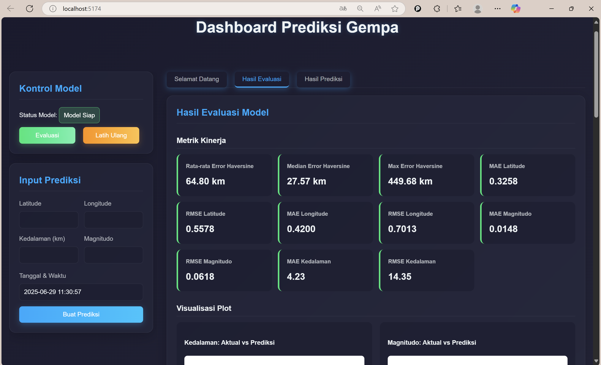

# Sistem Soft Sensor untuk Prediksi Lokasi Gempa

Sistem soft sensor untuk memprediksi 5 lokasi gempa berikutnya berdasarkan data historis. Proyek ini menggunakan model Machine Learning (Random Forest) dengan antarmuka yang dibangun menggunakan React.

## Tampilan Aplikasi (Screenshot)


---

## Fitur Utama
- **Input Data Gempa:** Memasukkan data gempa terakhir sebagai pemicu prediksi, meliputi lokasi (latitude & longitude), magnitudo, dan kedalaman.
- **Prediksi Lokasi:** Memberikan output berupa prediksi untuk 5 kemungkinan lokasi gempa berikutnya.
- **Model Random Forest:** Menggunakan model ensemble Random Forest yang telah dilatih untuk melakukan prediksi.
- **Antarmuka Interaktif:** Dibuat dengan React untuk pengalaman pengguna yang dinamis dan responsif.

## Teknologi yang Digunakan
* **Frontend:**
  * React
  * Vite
  * CSS
* **Backend & Machine Learning:**
  * Python
  * Scikit-learn (untuk model Random Forest)
  * Pandas
  * Flask / FastAPI *(pilih yang sesuai)*

## Instalasi & Cara Menjalankan

Berikut adalah langkah-langkah untuk menjalankan proyek ini secara lokal.

#### 1. Prasyarat
- **Node.js & npm:** [Download di sini](https://nodejs.org/)
- **Python 3.x:** [Download di sini](https://www.python.org/)

#### 2. Langkah-langkah Instalasi
1.  **Clone Repository**
    ```bash
    git clone [https://github.com/Azvi27/sistem-soft-sensor-prediksi-gempa.git](https://github.com/Azvi27/sistem-soft-sensor-prediksi-gempa.git)
    cd sistem-soft-sensor-prediksi-gempa
    ```

2.  **Unduh Model & Data yang Sudah Dibersihkan**
    File model (`.pkl`) dan dataset yang sudah dibersihkan (`.csv`) tidak disertakan dalam repository ini karena ukurannya yang besar.
    - **Unduh semua file dari:** [**Kelompok Teknologi sensor - Google Drive**](https://drive.google.com/drive/folders/1ah416wKLAoKcDzp0Em9lorp2I6gCZHF9)
    - **Petunjuk:** Setelah diunduh, letakkan semua file `.pkl` dan file `.csv` ke dalam folder `Kelompok Teknologi sensor/`.

3.  **Setup Backend (Python)**
    ```bash
    # Masuk ke folder backend
    cd "Kelompok Teknologi sensor"

    # Buat virtual environment (opsional tapi disarankan)
    python -m venv venv
    source venv/bin/activate  # atau `venv\Scripts\activate` di Windows

    # Install semua library yang dibutuhkan
    pip install -r requirements.txt

    # Jalankan API server
    python api.py
    ```

4.  **Setup Frontend (React)**
    *Buka terminal baru untuk langkah ini*
    ```bash
    # Masuk ke folder frontend
    cd Deteksi-Gempa

    # Install semua dependensi
    npm install

    # Jalankan aplikasi React
    npm run dev
    ```
    Buka `http://localhost:5173` (atau alamat lain yang muncul di terminal) di browser Anda.

## Sumber Data
Dataset yang digunakan dalam proyek ini adalah **"Earthquakes in Indonesia"** yang datanya bersumber dari katalog publik **Badan Meteorologi, Klimatologi, dan Geofisika (BMKG)**.

- **Periode Data yang Digunakan:** [Tulis rentang tahun data Anda, misal: 2008 - 2023]
- **Tautan Referensi:** [www.kaggle.com](https://www.kaggle.com/datasets/kekavigi/earthquakes-in-indonesia?select=katalog_gempa.csv)
